<!-- .slide: data-background-color="#fff" -->

## Automating the boring parts of Cyberpunk 2077

*How hard could computer vision possibly be?*

Notes:
- questions: after presentation

---

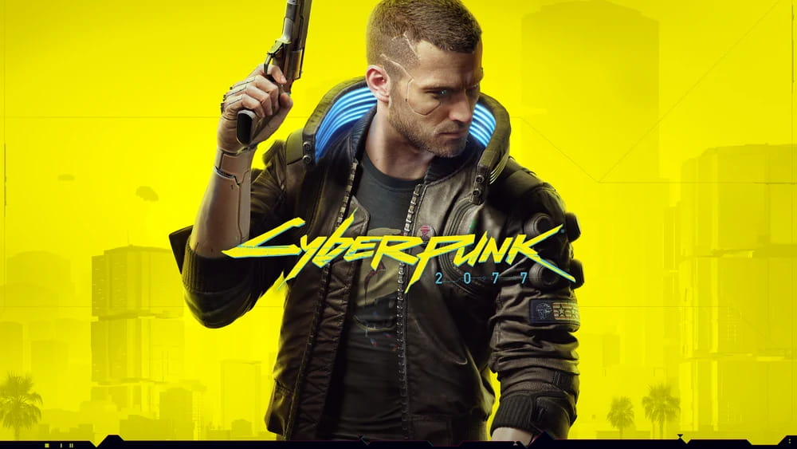

Notes:
- so this game called Cyberpunk 2077 was released
- I really liked playing it
- and...

----
<!-- .slide: data-transition="fade" data-background-image="img/cyberpunk_puzzle.jpg" data-background-size="contain" -->

Notes:
- it had this cool *hacking minigame*, where you had to...

----
<!-- .slide: data-transition="fade" data-background-image="img/cyberpunk_puzzle_1.jpg" data-background-size="contain" -->

Notes:
- find all of these sequences...

----
<!-- .slide: data-transition="fade" data-background-image="img/cyberpunk_puzzle_2.jpeg" data-background-size="contain" -->

Notes:
- from this "code matrix", and ...

----
<!-- .slide: data-transition="fade" data-background-image="img/cyberpunk_puzzle_3.jpeg" data-background-size="contain" -->

Notes:
- you have to do it with 4 to 8 clicks, depending on your upgrades.
- And

----
<!-- .slide: data-transition="fade" data-background-image="img/cyberpunk_puzzle_4.jpeg" data-background-size="contain" -->

Notes:
- when you pick a digit, your next guess is locked to the same row or column.
- Oh, and...

----
<!-- .slide: data-transition="fade" data-background-image="img/cyberpunk_puzzle_5.jpeg" data-background-size="contain" -->

Notes:
- you have like 30 seconds, **good luck**
- at first *it was fun*, but it got old very quickly and started to get boring.
- So like every programmer, I decided I would just...

---


## Just brute force it. ™

----

<iframe loading="lazy" src="https://cyberpunk-hacker.com" width="960px" height="700px"></iframe>

Notes:

- So I made this website, you could write the matrix there and it would solve it for you
    ```
    7A 55 E9 E9 1C 55
    55 7A 1C 7A E9 55
    55 1C 1C 55 E9 BD
    BD 1C 7A 1C 55 BD
    BD 55 BD 7A 1C 1C
    1C 55 55 7A 55 7A
    ```
    ```
    BD E9 1C
    BD 7A BD
    BD 1C BD 55
    ```

- and this was cool for a while
- but then I got tired of writing out the matrix

---

## There's gotta be a better way?

- I don't want to alt-tab out of the game <!-- .element: class="fragment" -->
- Point phone at screen and get solution? <!-- .element: class="fragment" -->

Notes:
- There's gotta be a better way
- I don't want to alt-tab, it's distracting
- I just wanna point my phone and get a solution
- **then I realized**, we already do something like this with out phones

----


1. point phone at screen <!-- .element: class="fragment" -->
2. ??? <!-- .element: class="fragment" -->
3. it knows what's on the screen <!-- .element: class="fragment" -->

Notes:
**QR codes, right?!**
1. point phone at screen
2. something magic computer vision happens
3. profit


---

## How hard could computer vision possibly be?

----


Notes:
- Turns out, there's this de-facto library for computer vision called **OpenCV**
- You can use C++, Python
- Even has a JavaScript library which uses WebAssembly
- **A-ha!**

----

### Great documentation!

<iframe loading="lazy" src="https://docs.opencv.org/4.6.0/d5/d10/tutorial_js_root.html" width="960px" height="700px"></iframe>

Notes:
- The documentation is surprisingly good
- Teaches you basic....*primitives* of sorts
- Sort of "basic building blocks" for computer vision
  - blurring
  - thresholding
  - *morphological transforms*: spread/pull together pixels
  - contours

---
<!-- .slide: data-auto-animate -->

### What do we need to do?

----
<!-- .slide: data-auto-animate -->

### What do we need to do?

1. Locate code matrix in the image

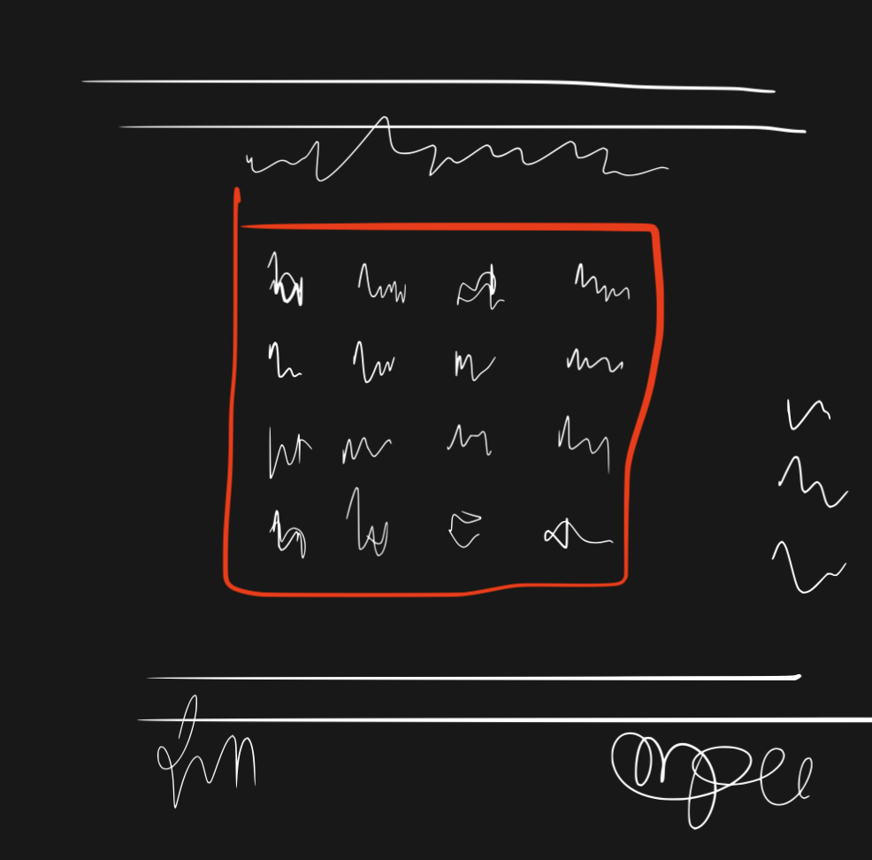

----
<!-- .slide: data-auto-animate -->

### What do we need to do?

1. Locate code matrix in the image
2. Turn the pixels into text

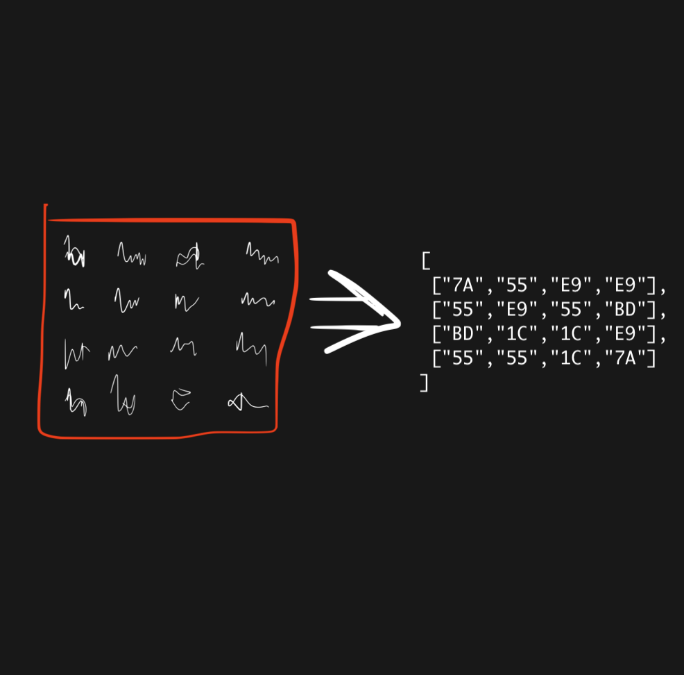

----
<!-- .slide: data-auto-animate -->

### What do we need to do?

1. Locate code matrix in the image
2. Turn the pixels into text
3. ???


---
<!-- .slide: data-auto-animate -->

### What do we need to do?

1. Locate code matrix in the image <!-- .element: data-id="1-locate-code-matrix-in-the-image"  -->
2. Turn the pixels into text
3. ???
4. Profit?

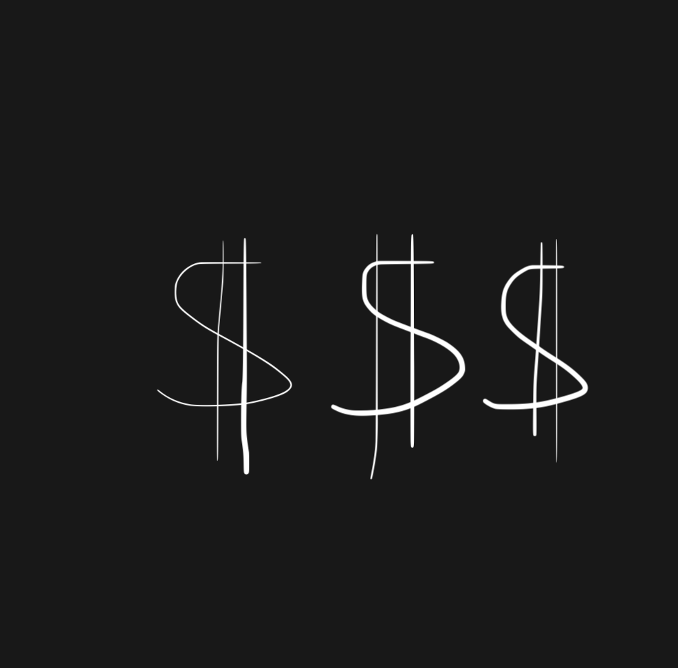

----

<!-- .slide: data-auto-animate -->

1. **Locate code matrix in the image** <!-- .element: data-id="1-locate-code-matrix-in-the-image" -->

<br/><br/>
- It already looks like a grid
- How do we find the coordinates of the grid?

----

#### 1. Crop

<div style="display: flex; align-items: center; justify-content: center;">
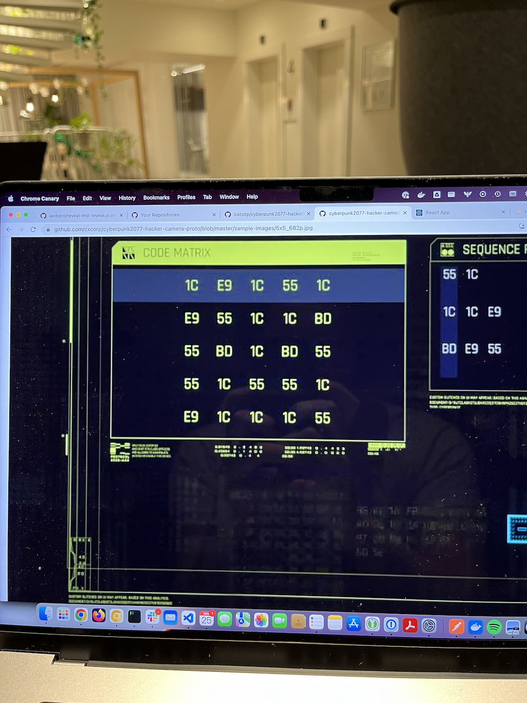
&nbsp;&nbsp;➝&nbsp;&nbsp;
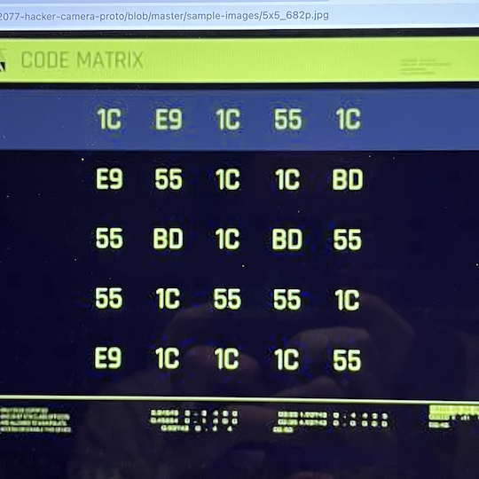
</div>

Notes:
- After we write some code to get a video stream from the user's camera
- we crop it to try to get rid of lens distortion and get a nice square image
- Lets us draw a nice red square for the user to focus on

----

#### 2. Grayscale & blur it

<div style="display: flex; align-items: center; justify-content: center;">

&nbsp;&nbsp;➝&nbsp;&nbsp;

</div>
<div style="display: flex; align-items: center; justify-content: center;">
&nbsp;&nbsp;➝&nbsp;&nbsp;
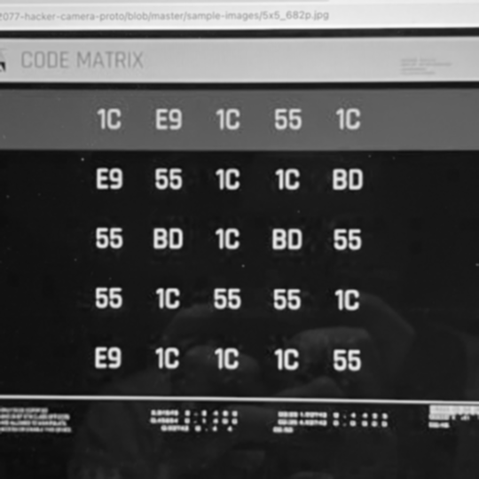
</div>

Notes:
- Many computer vision algorithms first blur the image to get rid of noise:
  - JPG artifacts
  - dust on the screen
- We don't want the colors because it makes things slow
- We don't **need the colors**

----

#### 3. Threshold & dilate

<div style="display: flex; align-items: center; justify-content: center;">

&nbsp;&nbsp;➝&nbsp;&nbsp;
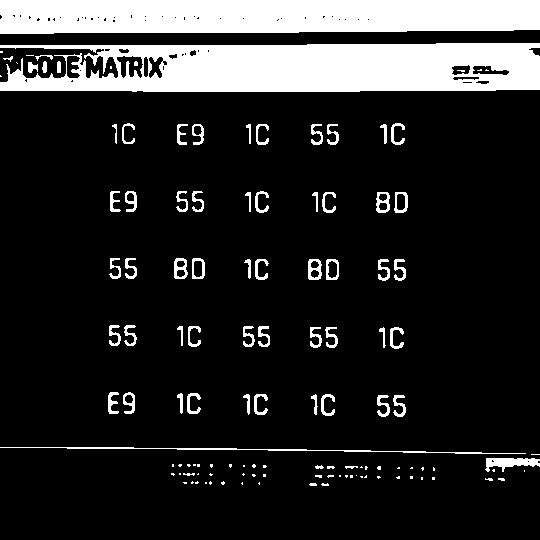
</div>
<div style="display: flex; align-items: center; justify-content: center;">
&nbsp;&nbsp;➝&nbsp;&nbsp;

</div>

Notes:
- Since our image is now black&white, it's basically just a grid of pixels
- Basically numbers from 0 to 255 from dark to bright
- Set some limit or *threshold* like 185
  - Pixel dimmer than 185 -> black
  - Brighter -> white
- Then we *dilate* the pixels, sort of expand white pixels
- Now it's already looking like a grid of points!

----

#### 4. Contours

<div style="display: flex; align-items: center; justify-content: center;">

&nbsp;&nbsp;➝&nbsp;&nbsp;
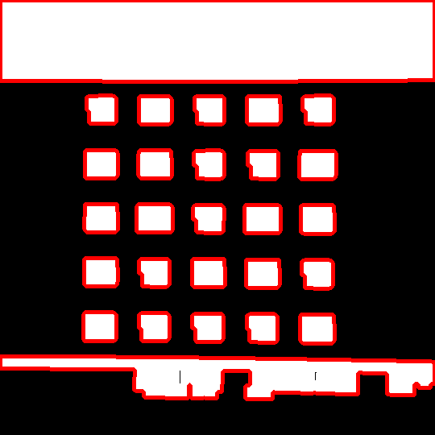
</div>
<div style="display: flex; align-items: center; justify-content: center;">
&nbsp;&nbsp;➝&nbsp;&nbsp;
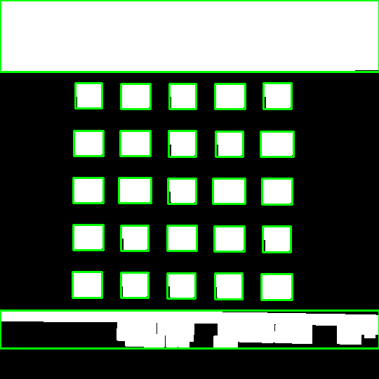
&nbsp;&nbsp;➝&nbsp;&nbsp;
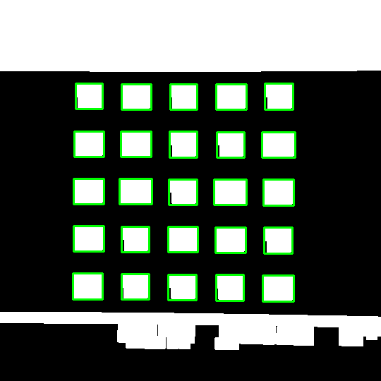
</div>

Notes:

- So how do we turn this grid into actual points?
- We grab so called **contours**, basically we find the outlines of shapes where the color changes
- The contours are a huge list of pixels or lines so...
-...we fit a rectangle around them, and throw away any rectangles that look too weird
- Looking good already!

----

#### 5. Corners of the grid

<div style="display: flex; align-items: center; justify-content: center;">

&nbsp;&nbsp;➝&nbsp;&nbsp;
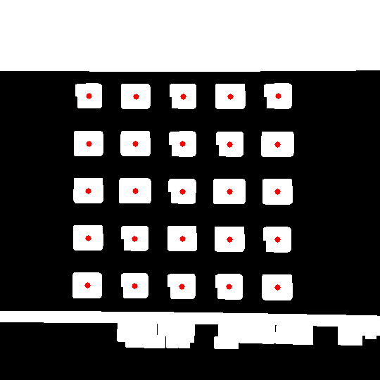
</div>
<div style="display: flex; align-items: center; justify-content: center;">
&nbsp;&nbsp;➝&nbsp;&nbsp;
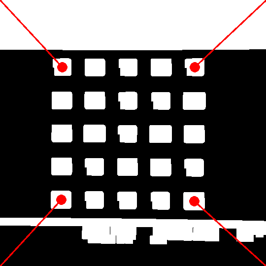
&nbsp;&nbsp;➝&nbsp;&nbsp;
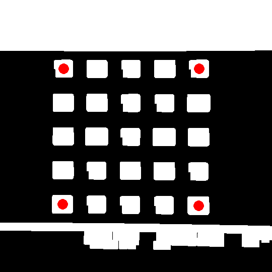
</div>

Notes:
- Now we can just grab the midpoints of the rectangles
- and find which are closest to the corners of the image

----

#### 6. We did it!

<div style="display: flex; align-items: center; justify-content: center;">

&nbsp;&nbsp;➝&nbsp;&nbsp;
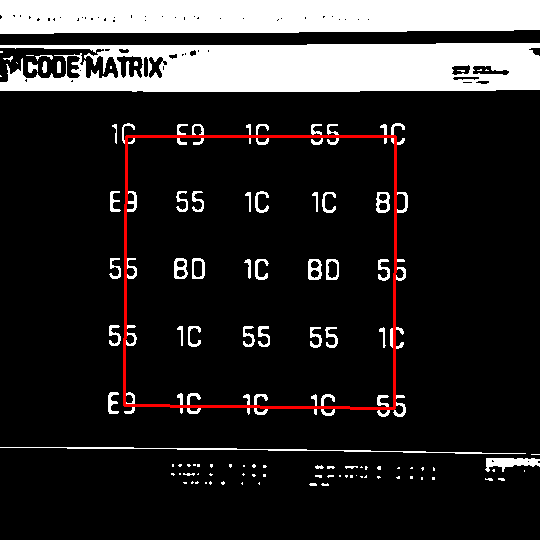
</div>
<div style="display: flex; align-items: center; justify-content: center;">
&nbsp;&nbsp;➝&nbsp;&nbsp;
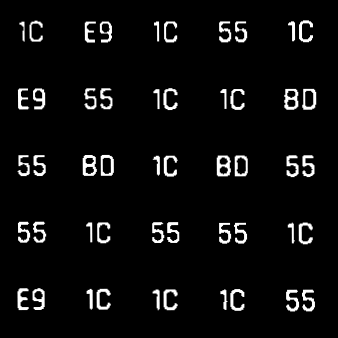
&nbsp;&nbsp;➝&nbsp;&nbsp;
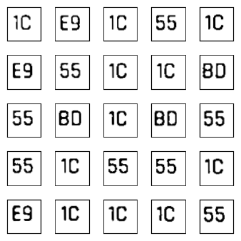
</div>

Notes:
- And there it is!
- Now we just follow a tutorial to fix the perspective so that instead of looking at it from the side, it looks like we scanned it.
- We can also then guess the grid size from the grid points

----

#### 7. Show the user

<div style="display: flex; align-items: center; justify-content: center;">

&nbsp;&nbsp;➝&nbsp;&nbsp;

</div>

Notes:
- It actually works so fast that it's real-time
- Now we can show the user that we found the matrix

---

<!-- .slide: data-auto-animate -->

### What do we need to do?

1. Locate code matrix in the image
2. Turn the pixels into text <!-- .element: data-id="2-turn-the-pixels-into-text" -->
3. ??? <!-- .element: style="opacity: 0.2" -->
4. Profit? <!-- .element: style="opacity: 0.2" -->

---

<!-- .slide: data-auto-animate -->

2. **Turn the pixels into text** <!-- .element: style="transition-duration: 250ms !important" data-id="2-turn-the-pixels-into-text"  -->

----

<!-- .slide: data-auto-animate -->

<!-- .slide: data-background-color="#fff" -->

2. **Turn the pixels into text** <!-- .element: style="transition-duration: 250ms !important" data-id="2-turn-the-pixels-into-text"  -->

<iframe loading="lazy" src="https://en.wikipedia.org/wiki/Optical_character_recognition" width="960px" height="500px"></iframe>

Notes:
OCR: optical character recognition
- in goes image, out comes text

----

<!-- .slide: data-background-color="#fff" -->

<iframe loading="lazy" src="http://localhost:3005/" width="960px" height="700px"></iframe>

Notes:
- one of the many libraries is Tesseract
  - open source, **free**
  - someone compiled it to WebAssembly
  - can run directly in the browser

----
<!-- .slide: data-auto-animate -->

### Helping Tesseract

<pre class="javascript" data-id="help-tesseract-code-js"><code data-line-numbers="">await tesseract.load();
await tesseract.loadLanguage("eng");
await tesseract.initialize("eng");
await tesseract.recognize(image);
</code></pre>

Notes:
- out of the box, tesseract is good for scanning book pages in a specific language

----

<!-- .slide: data-auto-animate -->

### Helping Tesseract

- Pre-process the image

<pre class="javascript" data-id="help-tesseract-code-js"><code data-line-numbers="">await tesseract.load();
await tesseract.loadLanguage("eng");
await tesseract.initialize("eng");
await tesseract.recognize(image);
</code></pre>

Notes:
- you have to preprocess the image, so remove noise and scanning artifacts, threshold the text
- we already did this

----

<!-- .slide: data-auto-animate -->

### Helping Tesseract

- Pre-process the image <!-- .element: style="opacity: 0.2" -->
- Train the language model with the game's font

<pre class="javascript" data-id="help-tesseract-code-js"><code data-line-numbers="2-3">await tesseract.load();
await tesseract.loadLanguage("eng_with_rajdhani_font");
await tesseract.initialize("eng_with_rajdhani_font");
await tesseract.recognize(image);
</code></pre>

Notes:
- I dug up the font used by the game
- you can fine-tune Tesseract's language models to understand the font better

----

<!-- .slide: data-auto-animate -->

### Helping Tesseract

- Pre-process the image <!-- .element: style="opacity: 0.2" -->
- Train the language model with the game's font <!-- .element: style="opacity: 0.2" -->
- Restrict possible characters

<pre class="javascript" data-id="help-tesseract-code-js"><code data-line-numbers="4-6">await tesseract.load();
await tesseract.loadLanguage("eng_with_rajdhani_font");
await tesseract.initialize("eng_with_rajdhani_font");
await tesseract.setParameters({
  tessedit_char_whitelist: " 1579ABCDEF"
});
await tesseract.recognize(image);
</code></pre>

Notes:
- We know the minigame only uses specific hexadecimal characters
- Euro symbol isn't there -> better use C instead

----

<!-- .slide: data-auto-animate -->

### Helping Tesseract

- Pre-process the image <!-- .element: style="opacity: 0.2" -->
- Train the language model with the game's font <!-- .element: style="opacity: 0.2" -->
- Restrict possible characters <!-- .element: style="opacity: 0.2" -->
- Change "Page Segmentation Modes"

<pre class="javascript" data-id="help-tesseract-code-js"><code data-line-numbers="4,6-7">await tesseract.load();
await tesseract.loadLanguage("eng_with_rajdhani_font");
await tesseract.initialize("eng_with_rajdhani_font");
await tesseract.setParameters({
  tessedit_char_whitelist: " 1579ABCDEF",
  tessedit_pageseg_mode: PSM.SINGLE_BLOCK,
});
await tesseract.recognize(image);
</code></pre>

Notes:
- page segmentation modes, tell tesseract what the text content is
  - single row of text
  - entire page of text
  - individual characters
  - block of text with no order

----


<!-- .slide: data-auto-animate -->

### Helping Tesseract

- Pre-process the image
- Train the language model with the game's font
- Restrict possible characters
- Change "Page Segmentation Modes"

<pre class="javascript" data-id="help-tesseract-code-js"><code data-line-numbers="2-7">await tesseract.load();
await tesseract.loadLanguage("eng_with_rajdhani_font");
await tesseract.initialize("eng_with_rajdhani_font");
await tesseract.setParameters({
  tessedit_char_whitelist: " 1579ABCDEF",
  tessedit_pageseg_mode: PSM.SINGLE_BLOCK,
});
await tesseract.recognize(image);
</code></pre>

Notes:
- with all of this combined...

----

<!-- .slide: data-background-color="#fff" -->

<iframe loading="lazy" src="http://localhost:3005/index_after.html" width="960px" height="700px"></iframe>

Notes:
- even if E9 gets detected as E, the E character is only used in E9 so it's ok
- besides, Tesseract gives us confidence values
  - slice out only that word or column
  - try with a different page segmentation mode

---

### All together now


----

<!-- .slide: data-auto-animate -->

#### Bonus for PC players: in stores now
[cyberpunk-hacker.com](https://cyberpunk-hacker.com/)

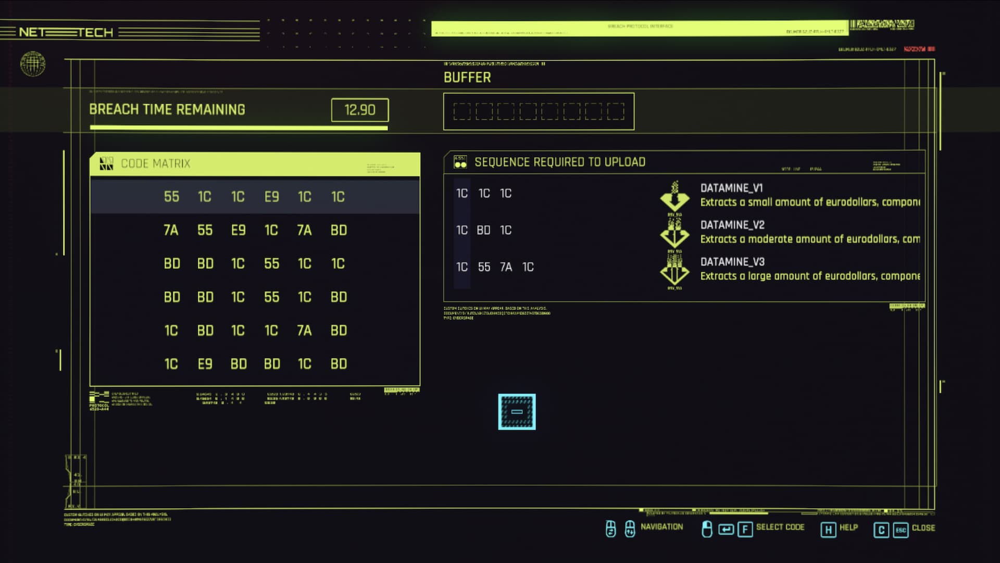

Notes:
- if you play on PC, I've published a version that solves the puzzle from **screenshots**

----

<!-- .slide: data-auto-animate -->

#### Bonus for PC players: in stores now
[cyberpunk-hacker.com](https://cyberpunk-hacker.com/)

<iframe loading="lazy" src="https://cyberpunk-hacker.com/" width="960px" height="700px"></iframe>

Notes:
- press **ESC** for overview
- *questions or thoughts?*

---

<video data-autoplay inline muted width="960px" height="700px" src="video/thank.mov" />

---

### How was this presentation made?

- <!-- .element: style="list-style: none" -->  <a target="_blank" href="https://github.com/cxcorp/how-hard-could-cv-be-presentation/blob/master/presentation/src/main.md?plain=1" rel="noreferrer noopener">cxcorp/how-hard-could-cv-be-presentation</a>
- <!-- .element: style="list-style: none" -->  <a target="_blank" href="https://github.com/webpro/reveal-md" rel="noreferrer noopener">webpro/reveal-md</a>
  - [reveal.js](https://revealjs.com/)